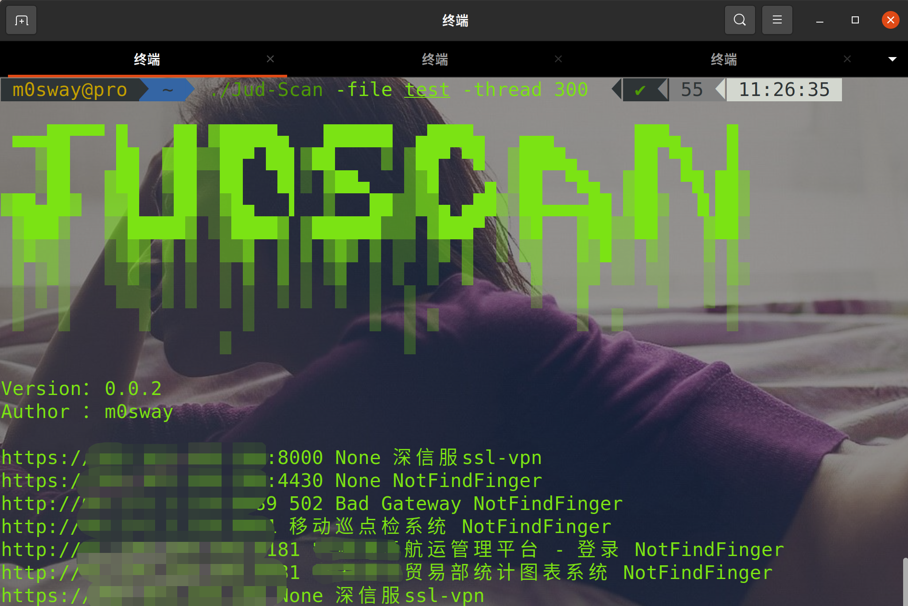

## 🌀 JuD-Scan  V0.0.4

JuD-Scan 定位是一个资产发现和识别工具；其特色功能在于快速识别 Web 指纹信息，定位资产类型。辅助红队快速定位目标资产信息。

JuD-Scan 拥有完善的指纹规则库。借助于 golang 并发优势，即可实现快速资产探测与识别 。

V0.0.1版本只是实现了最基本的资产探测。
目前采用线程300全端口扫描一个IP大约在1min左右。

后期将持续开发，做成一个**web应用**(适合团队协作的那种)，加入**子域挖掘**、**资产管理**、**POC验证**、**漏洞扫描**等功能，励志打造成一款红队渗透框架，JuD在手天下我有(~~我瞎说的~~)

## 🏂 Run

### 2021/09/05 update V0.0.4
增加指纹库中的内容。
优化了代码，使其在Linux下的体积为1.81M，在为Windows下的体积为1.75M，更方便内网渗透的时候使用。

### 2021/08/30 update V0.0.3
修复了Windows下的一个小bug
优化了代码，使其在Linux下的体积为2.1M，在为Windows下的体积为2.0M，更方便内网渗透的时候使用。

Dismap 对 Linux、Windows 均提供了二进制可执行文件，前往 [Release](https://github.com/m0sway/JuD-Scan/releases) 下载对应版本即可运行:
```Bash
# Linux
m0sway@pro  ~  chmod +x JuD-Scan

# Windows
m0sway@pro  ~  JuD-Scan.exe -h
```
>  


## 🎡 Options
```go
  -file string
    	文件名 (default "ip.txt")
    	# 从文件中读取 IP 进行批量识别
  -port string
    	端口 (default "Top100")
    	# 自定义需要扫描的端口,默认扫描Top100
  -thread int
    	线程数 (default 200)
   		# 多线程数量,默认200，建议不要超过500，数值越高偏差值越高。
```

## 🎨 Examples
```Bash
m0sway@pro  ~  ./Jud-Scan -file test -port 1-65535 -thread 300
```

## ⛪ Discussion
* JuD-Scan Bug 反馈或新功能建议[点我](https://github.com/m0sway/JuD-Scan/issues) 

