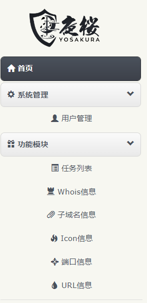
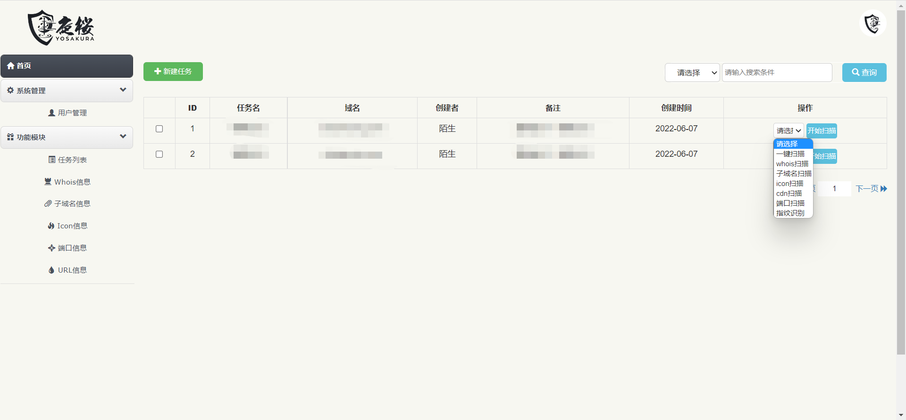
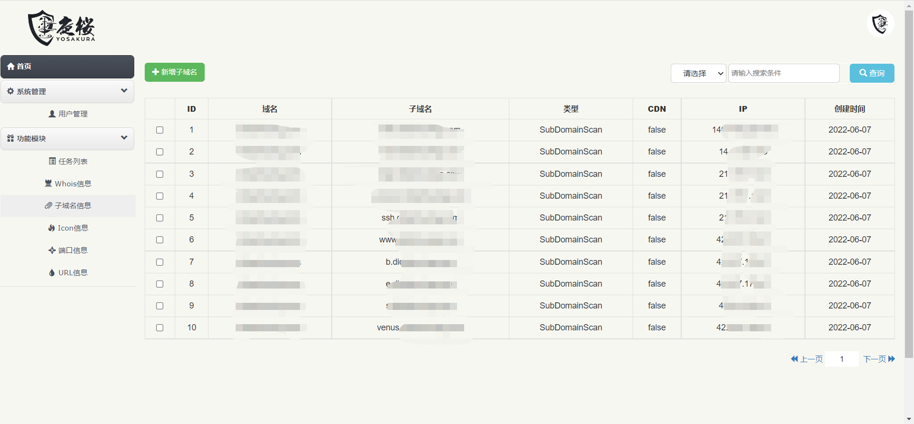

## 🌀 Yosakura  V1.2.0

Yosakura 定位是一个资产发现和识别工具；其特色功能在于快速识别 Web 指纹信息，定位资产类型。辅助红队快速定位目标资产信息。

Yosakura 拥有完善的指纹规则库。借助于 golang 并发优势，即可实现快速资产探测与识别 。


后期将持续开发，**POC验证**、**漏洞扫描**等功能，励志打造成一款红队渗透框架，JuD在手天下我有(~~我瞎说的~~)

**不想自己搭建的bro可以加群申请帐号，现已开放测试，有任何功能需求均可提。**

## 🏂 Run

```shell
sudo systemctl start nginx
sudo chmod u+x Yosakura
sudo ./Yosakura

#默认管理员账号密码为 m0sway:123456789
```

### 2022/06/06 update V1.0.0

### 2022/06/10 update V1.1.0
更新指纹库。

### 2022/06/14 update V1.1.2
修复一些小bug，增加了一些接口。
修改了IPv4的判断方式。

### 2022/06/21 update V1.2.0
增加了IP反查、IP段信息。


当前版本支持：用户增删改查、Whois信息查询、子域名信息查询、Icon信息查询、端口扫描、指纹识别、以及**一键执行信息收集**。


>  


## 🎡 Options

将SQL文件导入数据库。

将前端文件解压放在` /etc/nginx/sites-enabled/` 

```yaml
app:
  name: "YOSAKURA"
  mode: "dev"
  port: ":8765"

Mysql:
  host: "127.0.0.1"
  port: 3306
  user: ""
  password: ""
  dbname: ""
  max_open_conns: 200
  max_idle_Conns: 50

log:
  level: "debug"
  filename: "web.log"
  max_size: 200
  max_age: 39
  max_backups: 9

FOFA:
  mail: ""
  key: ""
```

需要先配置好配置文件，填入数据库账号密码以及数据库名，FOFA的mail和kay。

## 🎨 Examples
>  
>  


## ⛪ Discussion

* Yosakura Bug 反馈或新功能建议[点我](https://github.com/m0sway/JuD-Scan/issues) 
* Wechat：有任何反馈或建议也可入群聊交流。
>  

